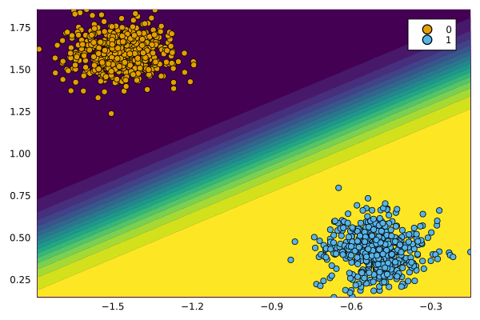
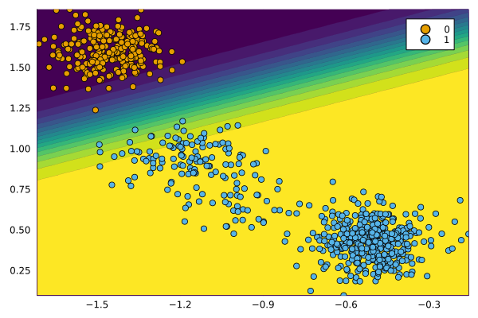

[](https://pat-alt.github.io/AlgorithmicRecourseDynamics.jl/stable) [](https://pat-alt.github.io/AlgorithmicRecourseDynamics.jl/dev) [](https://github.com/pat-alt/AlgorithmicRecourseDynamics.jl/actions/workflows/CI.yml?query=branch%3Amain) [](https://codecov.io/gh/pat-alt/AlgorithmicRecourseDynamics.jl) [](https://github.com/invenia/BlueStyle) [](https://github.com/SciML/ColPrac) [](https://twitter.com/paltmey)

# AlgorithmicRecourseDynamics

`AlgorithmicRecourseDynamics.jl` is a small package for modeling Algorithmic Recourse Dynamics. It builds on `CounterfactualExplanations`, a package for generating counterfactual explanations.

## Basic Usage

Below we first generate some synthetic data for a binary classification task and instantiate an instance of `CounterfactualData`.

``` julia
N = 1000
xmax = 2
X, ys = make_blobs(
    N, 2; 
    centers=2, as_table=false, center_box=(-xmax => xmax), cluster_std=0.1
)
ys .= ys.==2
X = X'
counterfactual_data = CounterfactualData(X,ys')
```

We then define a simple model for the task and prepare it for use with `CounterfactualExplanations.jl`:

``` julia
n_epochs = 100
model = Chain(Dense(2,1))
mod = FluxModel(model)
```

To generate algorithmic recourse, we will use a simple generic generator:

``` julia
generator = GenericGenerator()
```

Finally we train our model on a subset of the data. The chart below shows the results.

``` julia
data_train, data_test = Data.train_test_split(counterfactual_data)
Models.train(mod, data_train; n_epochs=n_epochs)
plt_original = plot(mod, counterfactual_data; zoom=0, colorbar=false)
display(plt_original)
```



### Simulation

To model the dynamics of algorithmic recourse, we use simulations, in which we repeatedly select as subset of individuals from the non-target class, generate and implement recourse for all of them and finally retrain the model. To set this experiment up, we can use the code below:

``` julia
models = Dict(:mymodel => mod)
generators = Dict(:wachter => generator)
experiment = set_up_experiment(data_train, data_test, models, generators)
```

Finally, we just run the experiment using default parameter settings that specify the number of rounds, the proportion of individuals to select for recourse and related aspects:

``` julia
run!(experiment)
```

The chart below shows the data and predictions at the end of the simulation:

``` julia
new_data = experiment.recourse_systems[1][1].data
new_model = experiment.recourse_systems[1][1].model
plt_original = plot(new_model, new_data; zoom=0, colorbar=false)
```



## Related Research Paper 📝

The package was developed for a research project that investigates the dynamics of various counterfactual generators. You can find the details [here](https://github.com/pat-alt/endogenous-macrodynamics-in-algorithmic-recourse).
