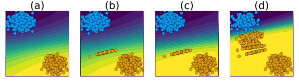

      

# AlgorithmicRecourseDynamics

`AlgorithmicRecourseDynamics.jl` is a Julia package for modeling Algorithmic Recourse Dynamics.

## Related Research Paper 📝

In this work we investigate what happens if Algorithmic Recourse is actually implemented by a large number of individuals. The chart below illustrates what we mean by Endogenous Macrodynamics in Algorithmic Recourse: (a) we have a simple linear classifier trained for binary classification where samples from the negative class (y=0) are marked in blue and samples of the positive class (y=1) are marked in orange; (b) the implementation of AR for a random subset of individuals leads to a noticable domain shift; (c) as the classifier is retrained we observe a corresponding model shift; (d) as this process is repeated, the decision boundary moves away from the target class.

