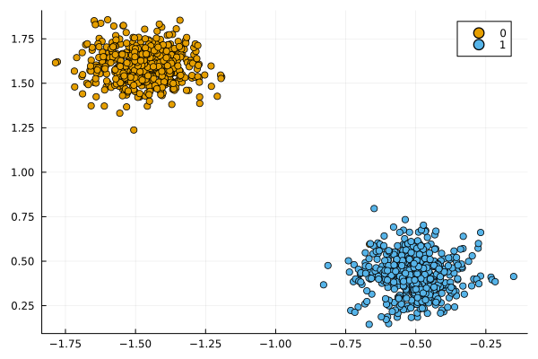
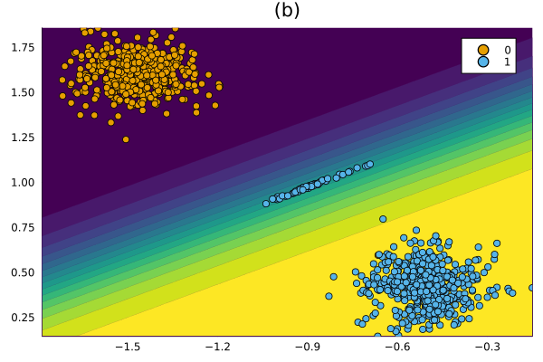
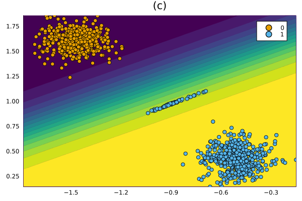
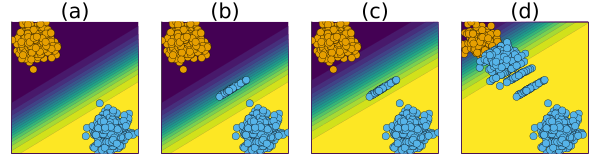

Proof of concept
================

To start with, we will look at a proof-of-concept that demonstrates the main observation underlying that paper is framed around. In particular, we will use synthetic data to see how endogenous domain shifts and the resulting model shifts can have implications on the validity and cost of algorithmic recourse.

## Data

We begin by generating the synthetic data for a simple binary classification problem. For illustrative purposes we will use data that is linearly separable. The chart below shows the data 𝒟 at time zero, before any implementation of recourse.

``` julia
N = 1000
xmax = 2
X, ys = make_blobs(
    N, 2; 
    centers=2, as_table=false, center_box=(-xmax => xmax), cluster_std=0.1
)
ys .= ys.==2
X = X'
xs = Flux.unstack(X,2)
data = zip(xs,ys)
counterfactual_data = CounterfactualData(X,ys')
plot()
scatter!(counterfactual_data)
```



## Classifier

To model this data 𝒟 we will use a linear classifier. In particular, as in the paper, we will build a logistic regression model in `Flux.jl`: a single layer with sigmoid activation.

``` julia
n_epochs = 100
model = Chain(Dense(2,1))
mod = FluxModel(model)
Models.train(mod, counterfactual_data; n_epochs=n_epochs)
```

The chart (a) below shows the linear separation of the two classes.

``` julia
plt_original = plot(mod, counterfactual_data; zoom=0, colorbar=false, title="(a)")
```


## Implementation of Recourse

### Generate counterfactual

``` julia
γ = 0.50
μ = 0.10
Markdown.parse(
    """
    To generate counterfactual explanations we will rely on the most generic approach. As our decision threshold we will use $(γ*100)% here. In other words, the counterfactual is considered as valid, as soon as the classifier is more convinced that it belongs to the target class (blue) than the non-target class (orange). In each round we will implement recourse for $(μ * 100)% of the individuals in the non-target class. 
    """
)
```

``` julia
opt = Flux.Adam(0.01)
gen = GenericGenerator(;decision_threshold=γ, opt=opt)
```

The chart (b) below shows the recourse outcome, which we denote here as 𝒟^(′). The obvious observation at this point is that the resulting counterfactuals, while valid, are clearly distinguishable from the factuals that were always in the target class. This is not a new observation and nor is it entirely surprising. In fact, a lot of recent work in this field has tried to address this issue. In this work we wonder what happens when we let these sorts of dynamics play out further in practice. While the outcome in (b) is not surprising, it may be much harder to observe so clearly it in practice (when the data is more complex).

``` julia
candidates = findall(ys.==0)
chosen_individuals = rand(candidates, Int(round(μ*length(candidates))))
X′ = copy(X)
y′ = copy(ys)
using CounterfactualExplanations.Counterfactuals: counterfactual, counterfactual_label
factuals = select_factual(counterfactual_data,chosen_individuals)
outcome = generate_counterfactual(factuals, 1, counterfactual_data, mod, gen; initialization=:identity)
X′[:,chosen_individuals] = reduce(hcat, @.(selectdim(counterfactual(outcome), 3, 1)))
y′[chosen_individuals] = reduce(vcat,@.(selectdim(counterfactual_label(outcome),3,1)))
counterfactual_data′ = CounterfactualData(X′,y′')
plt_single = plot(mod,counterfactual_data′;zoom=0,colorbar=false,title="(b)")
```



### Retrain

Suppose the agent in charge of the black-box system has provided recourse to a share of individuals leading to the outcome in chart (b). In practice, models are regularly updated through retraining to account for concept drift, for example. For our experiments, we assume that the agent accepts 𝒟^(′) as its new ground truth. To isolate the endogenous effects we are interested in here from any other effect, we further assume away any exogenous changes to the data that we might expect to occur in practice. Retraining the model on 𝒟^(′) leads to a shift of the decision boundary **in the direction of the non-target class**.

``` julia
mod = Models.train(mod, counterfactual_data′)
plt_single_retrained = plot(mod,counterfactual_data′;zoom=0,colorbar=false,title="(c)")
```



### Repeat

We finally go on to repeat this process of recourse followed by model updates for multiple round. The chart below presents the different stages of the experiment side-by-side, where panel (d) represents the outcome after ten rounds.

At first glance it seems that costs to individuals seeking recourse are gradually reduced as the decision boundary moves into the direction of the non-target class: they need to exert less effort to move to valid counterfactual states. The problem with this idea is, of course, that there is no free lunch. This reduction inflicts a burden on the agent in charge of the black-box: the group of individuals that is now classified as target class individuals looks entirely different from the original group.

Why is this a problem? Let’s, for example, that the two synthetic features accurately describe the credit worthiness of individual seeking loans, where credit-worthiness increases in the South-West direction. Non-target class individuals (orange) are denied credit, while target class individuals (blue) receive a loan. Then the population of borrowers in (d) is much more risky than in (a). Clearly, any lender (bank) aware of such dynamics would avoid them in practice. They might choose not to offer recourse in the first place, generating a cost to all individuals seeking recourse. Alternatively, they may reward first movers, but stop offering recourse after a few rounds.

This last point makes it clear that the implementation of recourse by one individual may generate external costs for other individuals. This notion motivates the ideas set out in the paper.

``` julia
i = 2
while i <= 10
    counterfactual_data′ = CounterfactualData(X′,y′')
    candidates = findall(y′.==0)
    chosen_individuals = rand(candidates, Int(round(μ*length(candidates))))
    Models.train(mod, counterfactual_data′)
    factuals = select_factual(counterfactual_data′,chosen_individuals)
    outcome = generate_counterfactual(factuals, 1, counterfactual_data′, mod, gen; initialization=:identity)
    X′[:,chosen_individuals] = reduce(hcat, @.(selectdim(counterfactual(outcome), 3, 1)))
    y′[chosen_individuals] = reduce(vcat,@.(selectdim(counterfactual_label(outcome),3,1)))
    i += 1
end
plt_single_repeat = plot(mod,counterfactual_data′;zoom=0,colorbar=false,title="(d)")
```

``` julia
plt = plot(plt_original, plt_single, plt_single_retrained, plt_single_repeat, layout=(1,4), legend=false, axis=nothing, size=(600,165))
savefig(plt, joinpath(www_path, "poc.png"))
plt
```


