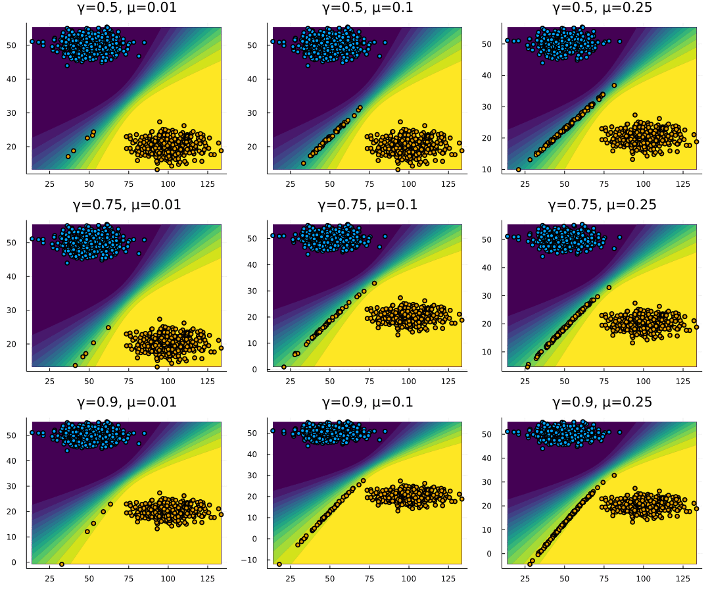

Responsible Professor: Dr. Cynthia Liem Supervisor: Patrick Altmeyer

### Background and motivation

Algorithmic recourse is an approach towards not only explaining black-box machine learning algorithms, but provide subjects who have been adversely affected by such with a realistic set of actions they can take in order to revise their outcome. The approach has been quickly growing in popularity during recent years, perhaps because the underlying tend to be methodologies tend to be intuitive and easy to implement. This project aims to shed some light on what happens *after* recourse is actually implemented. In particular, we want to investigate if and how the resulting domain shifts lead to model shifts and compare outcomes for different recourse generators.

The topic is also of great importance to society since automated decision-making through black-box algorithm affects all of us - inlcuding you! Suppose, for example, that upon graduation you apply for a job at a large coorperation. Unfortunately, you soon receive an email stating that you have not “met the short-listing criteria and no further feedback can be provided”. Unbeknown to you, the company has used an algorithm to decide who makes it onto the short list. The HR teams does not fully understand the inner workings of the algorithm, so they genuinely cannot provide you with feedback.

Algorithmic recourse aims to resolve these types of issues. But existing work has paid little attention to the dynamics of recourse. The first paper to consider the problem that algorithms are updated in response to (exogenous) domain shifts was presented at NeurIPS in December 2021 \[1\]. The authors propose a recourse generator that is robust to “small (and not drastic)” shifts. But rather than small shifts, we find that the actual implementation of recourse can lead to potentially quite large domain shifts and consequently model shifts. The animation below illustrates this: after a small share of individuals moves across the decision boundary, the classifier is updated in response. Evidently, the model shifts are quite significant in this toy example. Below we refer to these types of shifts as *endogenous* shifts.

We think that endogenous shifts deserve attention for various reasons:

1.  Our initial experimental results suggests that even generators that aim to produce realisitic counterfactuals can induce significant domain and model shifts.
2.  Model shifts in response to some individuals’ recourse may lead to undesired consequences (label switch) for other individuals.
3.  Individuals that have implemented recourse may end up forming their own distinct cluster in the feature domain. The original classifier could therefore be adapted to distinguish “recourse” indviduals in the target class from those that were always in the target class.

For a gentle introduction to the topic of algorithmic recourse you can check out this [primer](https://towardsdatascience.com/individual-recourse-for-black-box-models-5e9ed1e4b4cc) written by Patrick as part of his PhD application. To familiarize yourself further with the topic and [CARLA](https://github.com/carla-recourse/CARLA) you should all read this [paper](https://arxiv.org/pdf/2108.00783.pdf).

### Research Questions for the Sub-Projects

Collectively, students will discuss and agree on an answer to the following question:

-   How can we quantify endogenous domain and model shifts?

Individually, each of the students will then choose one of the recourse generators already implemented in [CARLA](https://github.com/carla-recourse/CARLA) and run a simple experiment (details below) to generate endogenous shifts - that is, provide and implement recourse - and quantify their magnitude. You will also each produce results for the baseline generator ([Wachter](https://arxiv.org/ftp/arxiv/papers/1711/1711.00399.pdf)) and benchmark the results from both generators.

You are free to choose any of the generators already implemented [CARLA](https://github.com/carla-recourse/CARLA), but below are five suggestions:

1.  [FACE](https://arxiv.org/pdf/1909.09369.pdf), \[2\]
2.  [REVISE](https://arxiv.org/pdf/1907.09615.pdf), \[3\]
3.  [CEM](https://arxiv.org/pdf/1802.07623.pdf), \[4\]
4.  [CEM-VAE](https://arxiv.org/pdf/1802.07623.pdf), \[4\]
5.  [AR-LIME](https://arxiv.org/pdf/1809.06514.pdf), \[5\]

Use the results to answer the following questions with respect to your chosen generator:

-   Does the magnitude of induced model shifts differ compared to the baseline generator?
-   If so, what factors might be playing a role here?
-   Based on your findings, what appear to be good ways to mitigate endogenous shifts?

While the individual part should really be done individually, do keep in mind that you will end up comparing the results of your experiments and you should therefore all generate the same, comparable output.

### Prerequisites

For this assignment, prior experience is Python is a requirement. A basic understanding of gradient-based optimization is helpful, but not a strict requirement.

### Q&A Session

If you’re interested in this project and/or have follow-up questions, please feel free to join us through [Zoom]() on one of these two sessions:

-   Tuesday, March 8, 12:45-13:25 (Zoom [link](https://us04web.zoom.us/j/77787187346?pwd=QFBh8Lc9iliVRzSSa9Yz9XFwZzUrXM.1))
-   Wednesday, March 9, 12:45-13:25 (Zoom [link](https://us04web.zoom.us/j/77845264541?pwd=QoHXseljKn_PMTDawWFrhHPX7AUaua.1))

### References

\[1\] Upadhyay S, Joshi S, Lakkaraju H. Towards robust and reliable algorithmic recourse. arXiv Preprint arXiv:210213620 2021.

\[2\] Poyiadzi R, Sokol K, Santos-Rodriguez R, De Bie T, Flach P. FACE: Feasible and actionable counterfactual explanations. Proceedings of the AAAI/ACM conference on AI, ethics, and society, 2020, p. 344–50.

\[3\] Joshi S, Koyejo O, Vijitbenjaronk W, Kim B, Ghosh J. Towards realistic individual recourse and actionable explanations in black-box decision making systems. arXiv Preprint arXiv:190709615 2019.

\[4\] Dhurandhar A, Chen P-Y, Luss R, Tu C-C, Ting P, Shanmugam K, et al. Explanations based on the missing: Towards contrastive explanations with pertinent negatives. Advances in Neural Information Processing Systems 2018;31.

\[5\] Ustun B, Spangher A, Liu Y. Actionable recourse in linear classification. Proceedings of the conference on fairness, accountability, and transparency, 2019, p. 10–9.

